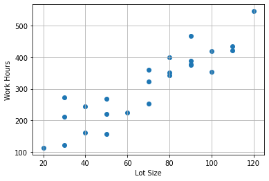
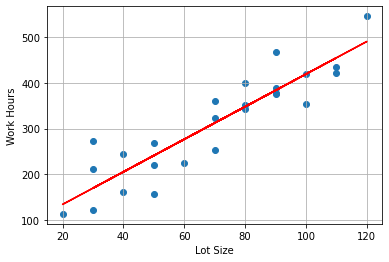
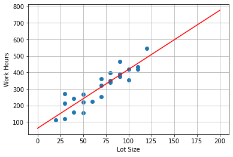

# 최적화 알고리즘을 이용한 회귀식 추정

- 일반적으로 회귀모델 비용 함수의 최솟값을 찾는 문제를 해결하기 위해 scikit-learn 경사하강법(gradient descent)을 이용하여 회귀선을 우선 구한 후 유전 알고리즘을 통해 해당하는 기울기와 y절편을 추정 하였습니다.


## [Linear Regression ( 선형 회귀 ) ](https://ko.wikipedia.org/wiki/선형_회귀)


통계학에서, 선형 회귀(線型回歸, 영어: linear regression)는 종속 변수 y와 한 개 이상의 독립 변수 (또는 설명 변수) X와의 선형 상관 관계를 모델링하는 회귀분석 기법이다. 

한 개의 설명 변수에 기반한 경우에는 단순 선형 회귀(simple linear regression), 둘 이상의 설명 변수에 기반한 경우에는 다중 선형 회귀라고 한다.


## Load Toluca Company Dataset


The Toluca Company manufactures refrigeration equipment as well as many replacement parts. 
In the past, one of the replacement parts has been produced periodically in lots of varying sizes. 
When a cost improvement program was undertaken, company officials wished to determine the optimum lot size for producing this part.


- Lot_size : 특정 날짜에 배송을 위해 주문하거나 단일 생산 실행에서 제조된 품목의 수량


- Work_hour : 작업 시간


```python
import pandas as pd
import matplotlib.pyplot as plt
from sklearn.linear_model import LinearRegression
```


```python
df = pd.read_csv('./toluca_company_dataset.csv') ## 데이터 불러오기
```


```python
plt.scatter(df['Lot_size'],df['Work_hours']) ## scatter plot

plt.xlabel('Lot Size')
plt.ylabel('Work Hours')

plt.grid()
plt.show()
```


    

    


## Linear Regression

- scikit-learn 패키지를 사용하여 선형 회귀분석을 하는 경우에는 linear_model 서브 패키지의 LinearRegression 클래스를 사용하여 회귀선을 구하였습니다.


- defalut 경사하강법 이용


```python
from sklearn.linear_model import LinearRegression

x = df['Lot_size'].values.reshape(-1,1) 
y = df['Work_hours']

model = LinearRegression()    # LinearRegression 클래스 객체를 생성한다.


model.fit(X = x, y = y)      
```


    LinearRegression()


```python
print("선형 회귀를 통하여 구한 기울기 : {0}, y 절편 : {1}".format(round(model.coef_[0],3),round(model.intercept_,3)))
```

    선형 회귀를 통하여 구한 기울기 : 3.57, y 절편 : 62.366


## Ploting - 1


```python
plt.scatter(df['Lot_size'],df['Work_hours']) ## 원 데이터 산포도
plt.plot(x, model.predict(x), color = 'r')

plt.xlabel('Lot Size')
plt.ylabel('Work Hours')
plt.grid()
plt.show()
```


    

    


---

## [Genetic Algorithm ( 유전 알고리즘 ) ](https://ko.wikipedia.org/wiki/유전_알고리즘)


GA는 우선 가능해의 집합(군집)을 형성하여 그 집합에 목적함수와 연관된 적합도 평가 후, 개체의 적합도에 따라 자연 선택을 확률적으로 이루어지게 하여 새로운 집합을 만든다. 

그 후 집합의 개체들 간 유전연산(이종교배, 돌연변이)을 적용, 새로운 종들을 만든 후 그 종들의 적합도를 평가한다. 

그리고 다시 자연선택 해서 새로운 무리를 형성하는 과정을 반복한다. 

이 반복되는 과정을 통해 자연에서의 진화현상에서 뛰어난 종들이 살아남듯, GA도 마찬가지로 뛰어난 해들이 남을 것이라 기대할 수 있다. 


유전 알고리즘은 선택, 교차, 변이, 대치 등 몇가지 주요 연산으로 구성된다


## Generate population ( 초기해 생성 )

- 최소 최대 길이를 입력받아 size(개체수) 만큼 random 숫자 생성


```python
import random
import string
```


```python

def generate_digits(length):
    result = ''
    x = ''.join(random.sample(string.digits, k=length))
    return x


def generate_population(size, min_len, max_len):
    
    population = []
    
    for i in range(size):
        
        length = i % (max_len - min_len + 1) + min_len # size 만큼 min ~ max 최소길이 부터 최대길이까지 균형 있게 생성
        
        population.append(generate_digits(length))
    
    return population

```


```python
# 2 ~ 4자리 랜덤 숫자 조합 생성

pop = generate_population(size=5, min_len=2, max_len=4)
print(pop)
```

    ['37', '476', '1268', '74', '215']


## Fitness Function ( 적합도 함수 )

적합도 함수 score 반환


- 길이가 같으면 0.5 점 +


- 길이가 다르면 score : 0


- 숫자를 문자로 처리하여, 같은 인덱스에서 같은 숫자면 score 1 씩 +


- 백분율로 반환


```python
def fitness(target, test_digit):
    
    score = 0

    if len(target) != len(test_digit):
        return score
    
    len_score = 0.5
    
    score += len_score

    for i in range(len(target)):
        if target[i] == test_digit[i]:
            score += 1

    return score / (len(target) + len_score) * 100
```


```python
print(fitness('123', '123'), fitness('123', '124'), fitness('123', '12345'))
```

    100.0 71.42857142857143 0


## Compute Performance

- 한 세대를 입력받아 점수 반환

- target의 자릿수 반환

- Score 내림차순으로 반환 및 target_len 반환


```python
def compute_performace(population, target):
    
    performance_list = []
    
    for individual in population:
        
        score = fitness(target, individual) 

        
        if score > 0:
            pred_len = len(individual)       
        
        performance_list.append([individual, score]) # 문자 값들과 score list에 저장

    population_sorted = sorted(performance_list, key=lambda x: x[1], reverse=True) # score 순 내림차순 정렬
    
    return population_sorted, pred_len
```


```python
# Ex
compute_performace(pop,"357")
```


    ([['476', 14.285714285714285],
      ['215', 14.285714285714285],
      ['37', 0],
      ['1268', 0],
      ['74', 0]],
     3)


## Select Survivors ( 선택 )

교차·변이 등을 거쳐서 만들어진 새로운 해를 해집단에 추가하고, 기존 해 중 열등한 해를 가려내서 제외시키는 연산이다. 

가장 품질이 나쁜 해를 대치하는 방법, 새로운 해의 부모해 중에서 새로운 해와 가장 비슷한 해를 대치시키는 방법(해집단의 다양성을 유지하기 위함) 등이 있다.

- 다음 세대가 너무 적을 경우 자체 랜덤 생성 ( 초기해 에서 0점이 많을 수 있음 )

- 점수가 높은 순으로 20개, 랜덤 추출 20개 추출하여 세대 반환


```python
def select_survivors(population_sorted, best_sample, lucky_few, target_len):
    
    next_generation = []
    
    # 생존 20  
    for i in range(best_sample):  
        
        if population_sorted[i][1] > 0:
            next_generation.append(population_sorted[i][0]) 

    # 램덤 20
    
    lucky_survivors = random.sample(population_sorted, k=lucky_few)
    
    for l in lucky_survivors:
        next_generation.append(l[0])
    
        
    while len(next_generation) < best_sample + lucky_few:
        next_generation.append(generate_digits(length=target_len))

    random.shuffle(next_generation)
        
    return next_generation
```

## Crossover ( 교차 )

생명체는 세대 내에서의 교배를 통해 다음 세대를 생성한다. 

이와 마찬가지로 유전 알고리즘에서 자연 선택된 해들은 교배를 통하여 다음 세대의 해들을 생성하게 된다. 


- 초기 100 명 중에 good 20 명 + lucky 20 40명 선발

- 20 커플

- 5 씩 교배(자식생산) 다음 세대 100명 자식


```python

def create_child(individual1, individual2):
    
    child = ''
    
    min_len_ind = min(len(individual1), len(individual2))
    
    for i in range(min_len_ind):
        
        if (int(100 * random.random()) < 50):
            child += individual1[i]
        
        else:
            child += individual2[i]
    
    return child


def create_children(parents, n_child):
    
    next_population = []
    
    for i in range(int(len(parents)/2)):
        
        for j in range(n_child):
            
            next_population.append(create_child(parents[i], parents[len(parents) - 1 - i]))
    
    return next_population
```

## Mutation ( 변이 )

일반 생명체에서, 유전자의 교배 뿐 아니라, 하나의 유전자가 직접적으로 변이를 일으켜서 주어진 환경에서 살아남을 확률 역시 존재한다. 

변이 연산은 주어진 해의 유전자 내의 유전 인자의 순서 혹은 값이 임의로 변경되어 다른 해로 변형되는 연산이다. 

- 돌연변이 확률 10 % 로 숫자 변경


```python
def mutate_word(word):
    
    idx = int(random.random() * len(word))
    
    if (idx == 0):
        word = random.choice(string.digits) + word[1:]
    else:
        word = word[:idx] + random.choice(string.digits) + word[idx+1:]
    
    return word

def mutate_population(population, chance_of_mutation):
    
    for i in range(len(population)):
        
        if random.random() * 100 < chance_of_mutation:
            population[i] = mutate_word(population[i])
    
    return population
```

## Main()

- 300회 반복


- 초기해 100 명


- best score 20 + lucky 20


- 교배 자식 5명 총 100


- 돌연변이 10 %


```python
min_len = 1
max_len = 5

n_generation = 300 # 세대

population = 100 # 초기 개체 수

best_sample = 20 # 생존

lucky_few = 20 # 럭키

n_child = 5 # 교배 수

chance_of_mutation = 10 # 돌연 변이 확률

```


```python
# 기울기

target = str(int((round(model.coef_[0],2))*100))


pop = generate_population(size=population, min_len=min_len, max_len=max_len) # 초기 100개 개체 


for g in range(n_generation):
    
    pop_sorted, pred_len = compute_performace(population=pop, target=target) # 적합도 검사 (fitness in)

    if int(pop_sorted[0][1]) == 100: # 일치하는 것을 찾으면 출력 + main break
        print()
        print('{0}th Generation SUCCESS! {1} '.format(g+1,int(pop_sorted[0][0])/100))
        w = int(pop_sorted[0][0])/100
        generation_w = g+1
        break
    
    survivors = select_survivors(population_sorted=pop_sorted, best_sample=best_sample, lucky_few=lucky_few, target_len=pred_len)
    
    children = create_children(parents=survivors, n_child=n_child)

    new_generation = mutate_population(population=children, chance_of_mutation=10)
    
    pop = new_generation # 다음세대 > 이전 세대 
    
    # 각 세대에서 제일 높은 socre 출력
    print('===== %sth Generation max=====' % (g + 1))
    print(pop_sorted[0])
    

```

    ===== 1th Generation max=====
    ['853', 42.857142857142854]
    ===== 2th Generation max=====
    ['855', 42.857142857142854]
    ===== 3th Generation max=====
    ['350', 71.42857142857143]
    ===== 4th Generation max=====
    ['347', 71.42857142857143]
    
    5th Generation SUCCESS! 3.57 


```python
# y 절편 

target = str(int((round(model.intercept_,2))*100))

pop = generate_population(size=population, min_len=min_len, max_len=max_len) # 초기 100개 개체 

   
for g in range(n_generation):
    
    pop_sorted, pred_len = compute_performace(population=pop, target=target) # 적합도 검사 (fitness in)

    if int(pop_sorted[0][1]) == 100: # 일치하는 것을 찾으면 출력 + main break
        print()
        print('{0}th Generation SUCCESS! {1} '.format(g+1,int(pop_sorted[0][0])/100))
        b = int(pop_sorted[0][0])/100 
        generation_b = g+1
        break
    
    survivors = select_survivors(population_sorted=pop_sorted, best_sample=best_sample, lucky_few=lucky_few, target_len=pred_len)
    
    children = create_children(parents=survivors, n_child=n_child)

    new_generation = mutate_population(population=children, chance_of_mutation=10)
    
    pop = new_generation # 다음세대 > 이전 세대 
    
    # 각 세대에서 제일 높은 socre 출력
    print('===== %sth Generation max=====' % (g + 1))
    print(pop_sorted[0])
    
```

    ===== 1th Generation max=====
    ['1236', 55.55555555555556]
    ===== 2th Generation max=====
    ['0236', 55.55555555555556]
    ===== 3th Generation max=====
    ['8230', 55.55555555555556]
    ===== 4th Generation max=====
    ['1207', 55.55555555555556]
    ===== 5th Generation max=====
    ['2235', 55.55555555555556]
    ===== 6th Generation max=====
    ['2236', 55.55555555555556]
    ===== 7th Generation max=====
    ['2236', 55.55555555555556]
    ===== 8th Generation max=====
    ['8230', 55.55555555555556]
    ===== 9th Generation max=====
    ['6230', 77.77777777777779]
    ===== 10th Generation max=====
    ['6236', 77.77777777777779]
    ===== 11th Generation max=====
    ['6230', 77.77777777777779]
    ===== 12th Generation max=====
    ['6230', 77.77777777777779]
    ===== 13th Generation max=====
    ['6230', 77.77777777777779]
    
    14th Generation SUCCESS! 62.37 


```python
print("{0} 세대 기울기 : {1},  {2} 세대 y 절편 : {3}".format(generation_w,w,generation_b,b))
```

    5 세대 기울기 : 3.57,  14 세대 y 절편 : 62.37


## Ploting - 2


```python
import matplotlib.pyplot as plt
import numpy as np

x = np.linspace(0,200,100)
y = w*x+b

plt.scatter(df['Lot_size'],df['Work_hours']) 
plt.plot(x, y, '-r')

plt.xlabel('Lot Size')
plt.ylabel('Work Hours')

plt.grid()
plt.show()


```


    

    


---
